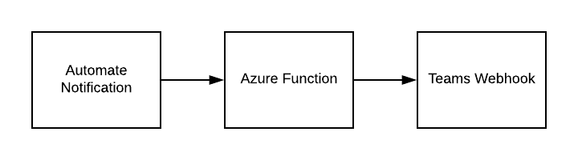
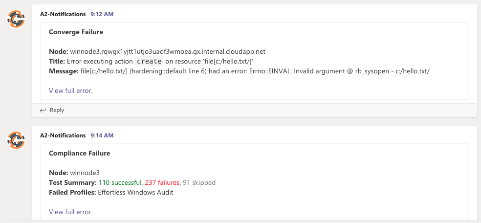
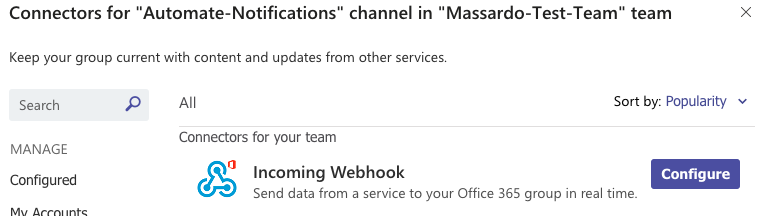
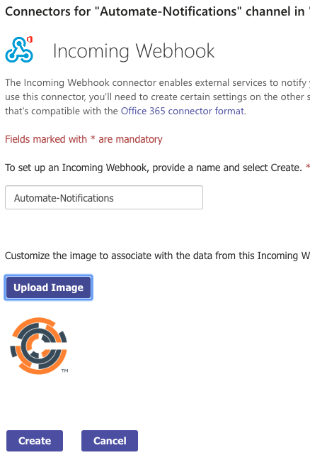
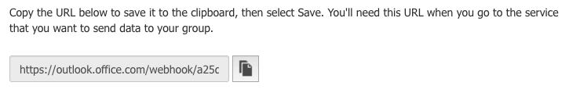
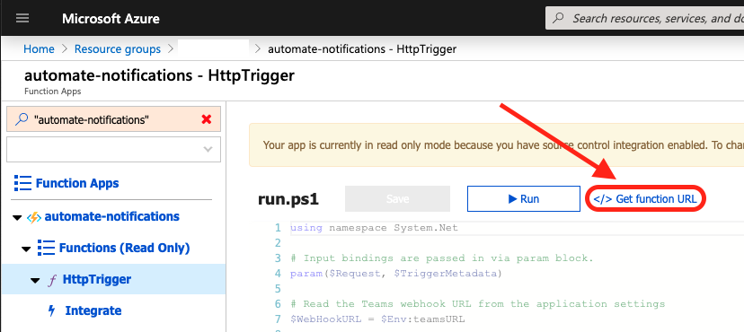

# Chef Automate Teams Notifications

## Introduction

Greetings! This repo contains a workaround to allow [Chef Automate](https://automate.chef.io) to send failure notifications to [Microsoft Teams](https://teams.microsoft.com)

## Components

To facilitate the notifications, this repo uses an [Azure Function](https://azure.microsoft.com/en-us/services/functions/) with an `HttpTrigger` to intercept the webhook from Automate, translate it into a payload for Teams, then send that new payload to the Teams webhook URL.



This may sound complicated but it's really bad at all. Automate sends a JSON payload with a lot of data in it. This is great in that can get a lot of detail, but bad because Teams expects a simple text payload. This function picks out some important bits of data and concatenates them into a simple text string for Teams. It also adds a link so you can go straight to the full message in Automate.

 We end up with a nice message like these:



## Usage

It may feel weird, but we need to set up things starting at the destination, then working back to the origin of the notification.

### Teams

The first task is to set up a channel and a webhook connector. If you want send the notifications to an existing channel, skip to the create connector steps.

1. Create a channel by clicking the `...` to the right of the team name, then select `add channel`

1. Next, click the `...` to the right of the channel name, then select `connectors`
1. Now, select `Configure` for the `Incoming Webhook` connector

1. Give the connector a name and provide a icon if desired, then click `Create`

1. Finally, copy the webhook URL for use in the next section.


### Azure Function

In this example, I'm using `azcli` commands to set up the function, feel free to use other options if there's one you like better.

``` bash
# create a resource group to hold the function and stuff
az group create -n my-rg-name -l centralus

# create storage account for function
az storage account create -g my-rg-name -n automatenotifications

# create the function
az functionapp create -g my-rg-name -n automate-notifications -s automatenotifications --runtime powershell --deployment-source-url https://github.com/jmassardo/a2-teams-notification.git --consumption-plan-location centralus

# create app setting for Teams Webhook URL
az functionapp config appsettings set --resource-group my-rg-name --name automate-notifications --settings teamsURL=https://outlook.office.com/webhook/xxxxxxx-xxxxxxx-xxxxxxxx-xxxxxxxxxxx
```

> NOTE: Consider cloning/forking the GitHub repo in the 3rd step to give you better control of how code enters your environment.

Now we need to get the invoke url for the function. You can get it via the Azure Portal or use the [Azure Function Core Tools](https://docs.microsoft.com/en-us/azure/azure-functions/functions-run-local#v2).



``` bash
# List the function with the invoke url
func azure functionapp list-functions automate-notifications --show-keys

# Output
Functions in automate-notifications:
    HttpTrigger - [httpTrigger]
        Invoke url: https://automate-notifications.azurewebsites.net/api/httptrigger?code=xxxxxxxxxxxxxxxxxxxxxxxxx
```

### Automate

That wasn't too bad. Let's move onto the last bit and set up the actual notification.

1. Log into your automate server and go to the Settings > Notifications page [https://automate.example.com/settings/notifications](https://automate.example.com/settings/notifications).
1. Select `Create Notification`
1. Check the `Webhooks` box
1. Give the notification a name, select the failure type, then enter the invoke url for the function and click `Save Notification`.

## Customizing

In the highly likely event one would like to customize the notifications, the heavy lifting is done by the [run.ps1](HttpTrigger/run.ps1) script. Lines 13-17 assemble the message for converge failures and lines 25-29 assemble the message for compliance failures.

The contents of the payloads aren't officially documented, however, the code is available on GitHub.

* [Converge Failures](https://github.com/chef/automate/blob/master/components/notifications-service/server/lib/formatters/webhook.ex#L23-L38)
* [Compliance Failures](https://github.com/chef/automate/blob/master/components/notifications-service/server/lib/formatters/webhook.compliance.ex#L21-L34)

## Closing

If all went well, you should start seeing notifications within a few minutes (give or take, depending on your client interval/splay).

Hopefully, you find this to be useful. If you have any questions or feedback, please feel free to contact me: [@jamesmassardo](https://twitter.com/jamesmassardo).
